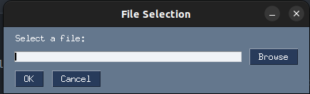
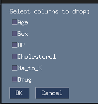

# AutoML-Pipeline

AutoML-Pipeline is a Python project that aims to simplify the process of building and evaluating machine learning pipelines. The project provides an automated pipeline that performs data preprocessing, feature selection, algorithm selection, and model evaluation, with the flexibility to choose between classification and regression tasks.

## Features

- Automated data preprocessing including handling missing values, label encoding, and data type conversion.
- Interactive GUI for selecting and dropping columns, and choosing the target column.
- Visualization of data distribution using histograms.
- Option to choose between classification and regression tasks.
- Selection of various machine learning algorithms for the chosen task.
- Model evaluation metrics displayed through a popup window.

## Screenshots

Here are a few screenshots of the AutoML-Pipeline GUI:


*Fig. 1: Preprocessing data and selecting target column.*


*Fig. 2: Choosing columns to drop and selecting problem type.*


*Fig. 3: Selecting an algorithm and running the pipeline.*

## Getting Started

1. Clone the repository:
   ```bash
   git clone https://github.com/Mostafa-Tarek-00/AutoML-Pipeline.git
   ```

2. Install the required libraries by running:
   ```bash
   pip install pandas numpy matplotlib seaborn scikit-learn PySimpleGUI xgboost
   ```

3. Run the `main.py` script to launch the AutoML-Pipeline GUI:
   ```bash
   python AutoML-Pipeline.py
   ```
   
4. Follow the interactive GUI prompts to preprocess data, select columns, choose the target column, and run the selected algorithm.

## Usage

1. Launch the GUI by running the `AutoML-Pipeline.py` script.
2. Select a dataset file in CSV or Excel format.
3. Preprocess the data by handling missing values and label encoding.
4. Choose columns to drop if necessary.
5. Select the target column for your task.
6. Choose between a classification or regression task.
7. Select an algorithm from the available options.
8. After running the algorithm, a popup window will display evaluation metrics.

## Project Coming Updates

- **First**: Introduced user-configurable parameters, including handling unbalanced data columns, improved data preprocessing, and enhanced visualization options.
- **Second**: Introduced user-configurable parameters, including handling unbalanced data columns, improved data preprocessing, and enhanced visualization options. Users can now adjust model parameters and combine multiple models for better results.

## Note

- The project is intended for educational purposes and might require further refinement for production use.
- The available algorithms and evaluation metrics can be extended based on your needs.

